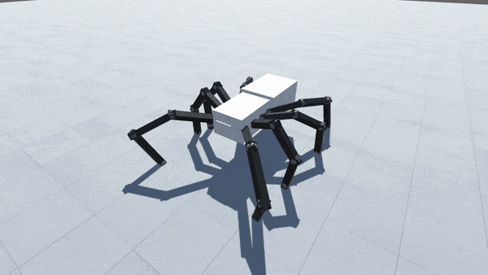
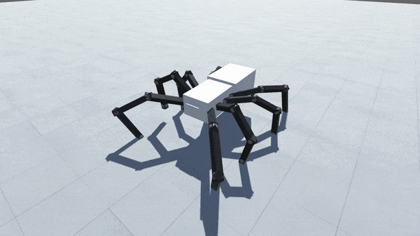
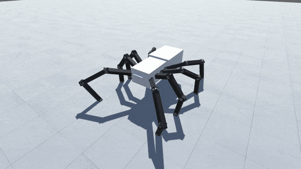

 
<h1 align="center">Procedural Animation</h1>
<h4 align="center">A procedurally animated spider in unity using inverse kinematics.</h4>
 

## Description
I've been fascinated by procedural animation and inverse kinematics for quite some time so I finally decided to try my hand at implementing these features in a small-scale project. Overall this proved to be an excellent learning experience.

I used several resources to get myself acquinted with the basic mechanics and mathematical formulas needed to move the spider's legs, and Daniel Erdmann's open source [Fast IK](https://assetstore.unity.com/packages/tools/animation/fast-ik-139972) inverse kinematic solver to animate them. The legs are fully usable on any body and in any numbers, and only require you to set the position and size of the "stepping area" along with the leg side and number.

Currently the spider (V2.2) has three degrees of freedom and is able to move forwards and backwards, sideways and turn along its Y-axis.

## Demonstration gifs

  
  

  
  

## Builds
_The project currently doesn't behave entirely correctly in the build possibly due to how Fast IK handles different frame rates._

- [V2.2](https://github.com/jerejoensuu/Procedural-Animation/releases/tag/v2.2)

## Future plans
- Further optimize and clean code
- Make creating new creatures easier
- Add Jumping functionality
- Add functionality for detecting and climbing over obstacles
- Add a simple environment to explore
- Add functionality to scale and cling to walls and ceilings
