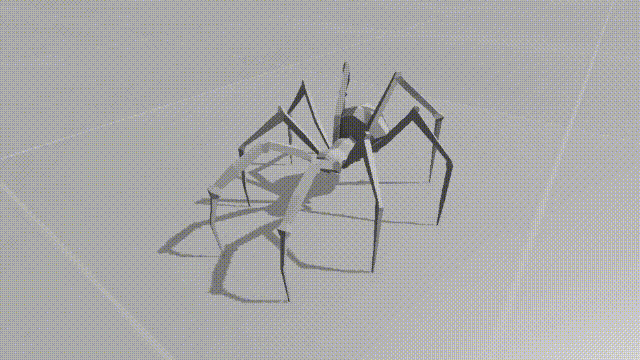
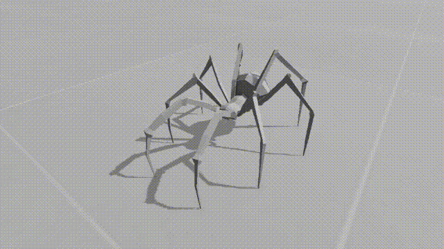
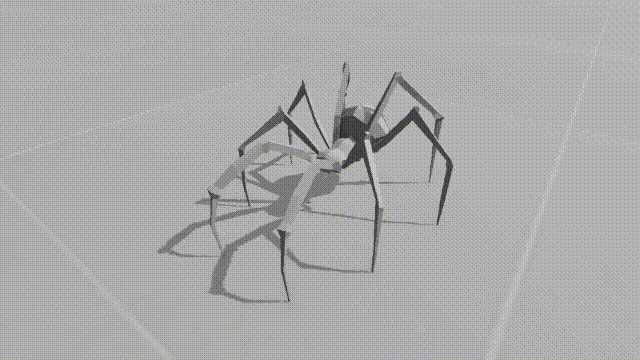
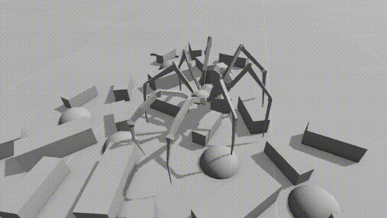
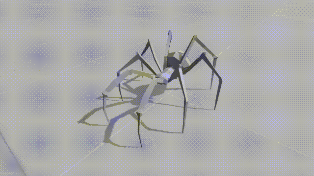

 
<h1 align="center">Procedural Animation</h1>
<h4 align="center">A Unity technical demo for procedural creature animation using inverse kinematics.</h4>
 

## Disclaimer

**This project is presented as a technical portfolio demonstration and is not intended for public use, distribution, or integration as a ready-made package. The codebase and project structure reflect an internal development prototype, with the primary focus placed on demonstrating procedural animation, inverse kinematics, and creature movement systems rather than external readability, documentation, or ease of setup.**

## Overview

**Procedural Animation** is a Unity-based technical demo showcasing procedural leg movement, inverse kinematics, and reusable creature animation systems.

The project explores animation techniques used for multi-legged creatures, with an emphasis on systems that can adapt to different body shapes, leg counts, movement directions, and terrain conditions. It serves as a portfolio piece and a foundation for animation technology being developed for an upcoming professional game project.

## Features

* Procedural leg placement and stepping logic
* Inverse kinematics-based leg animation
* Support for forward, backward, sideways, and turning movement
* Configurable legs that can be adapted to different creature bodies
* Adjustable stepping areas and leg settings

## Demonstration

  
  

  
  

  
  

## Notes

This project is intended as a technical portfolio demo rather than a standalone game or publicly released build. The focus is on demonstrating procedural animation systems, inverse kinematics, and creature movement logic inside Unity.
